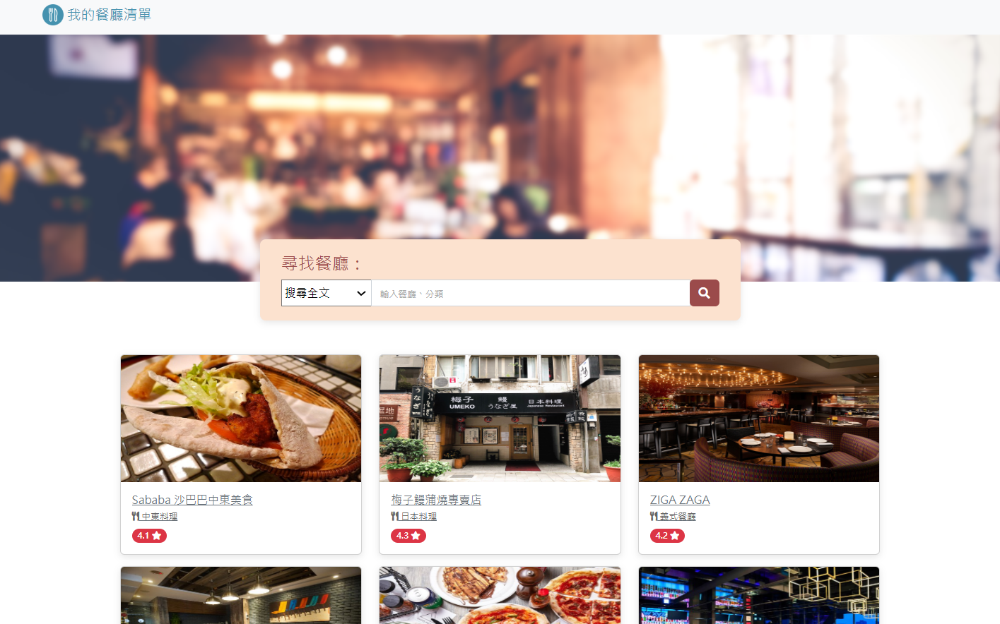
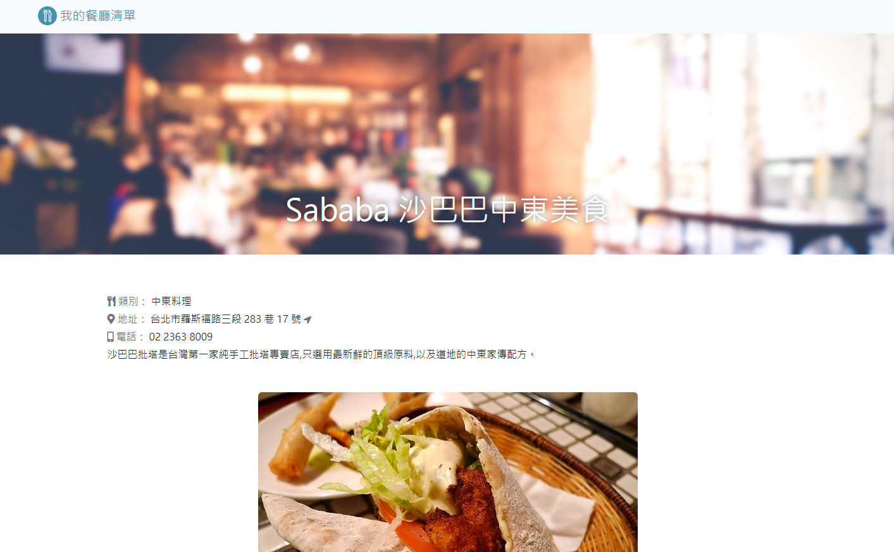

# Restaurant List

Search restaurants to find what to eat the next meal!




## Features

- Browse the restaurant list
- Get the detail info about the restaurant
- Find the location of the restaurant through Google Map
- Search restaurant by keyword, name or category

## Getting Started

### Prerequisite

- Node.js
- npm

### Installation

1. Clone the repository

2. Move to the repository and install dependencies

   ```
   npm install
   ```

3. Launch the web app

   ```
   npm run start
   ```

4. Open the browser and go to

   ```
   http://localhost:3000
   ```

5. Terminate the web app

   ```
   crtl + c
   ```

## Development Tool

- Node.js v18.15.0
- Express.js v4.18.2
- Express-Handlebars v7.0.7
- Bootstrap v5.2.1
- Font-awesome v5.8.1
